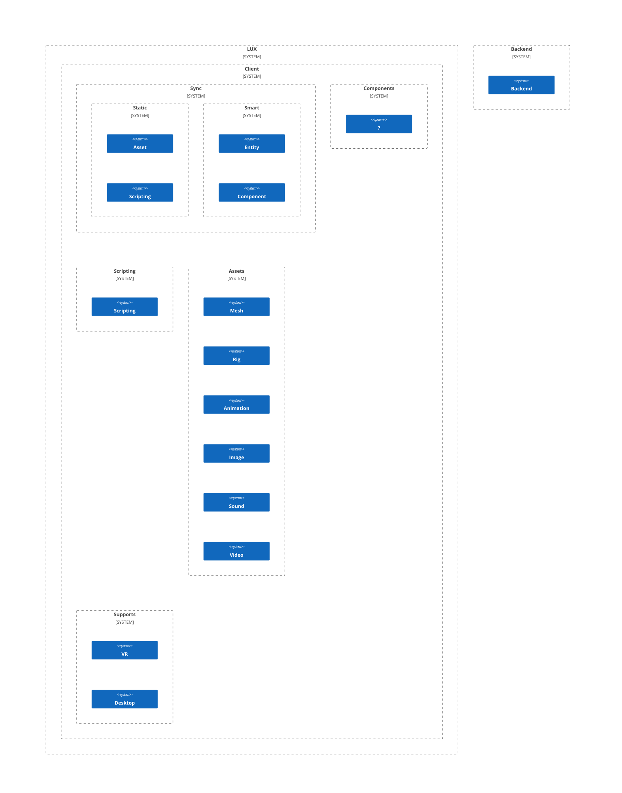

# Architecture

## Components/Units

## Interactions

### Booststrap

- Main screen -> world selection
- How differnt is interacton in VR?

### Hosting

### Connecting to a host

### Backend (optional)

Backends are not needed for hosting nor for local use. If not logged in the user will remain anonymous and only have access to local disk for storage.

#### Federated login option

Maybe using https://github.com/NexusSocial/NexusProtocol/

### ...

